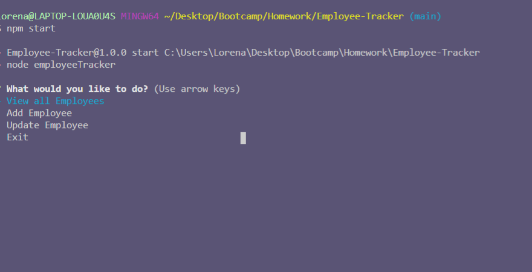
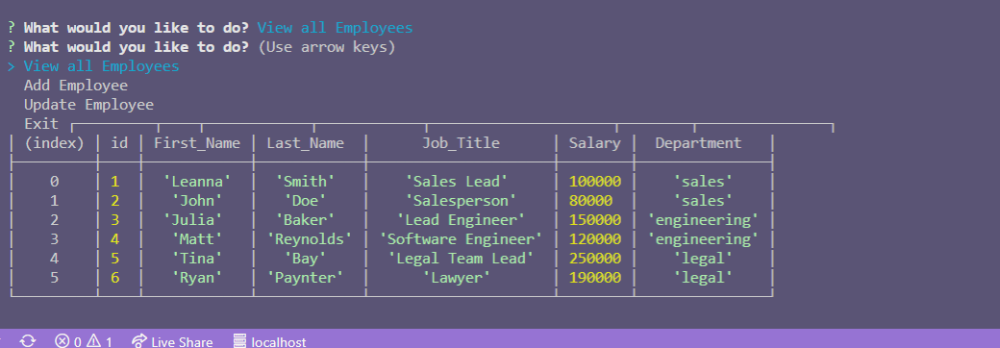
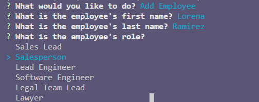

# Employee-Tracker
## Description
  ---
  This interface is used a **C**ontent **M**anagement **S**ystem which is node based and uses inquirer and MySQL. This allows a company to view all employees in their database as well as add new employees to their database. 
  ## Table of Contents 
  --- 
  [Application](#application)

  [Installation](#installation)

  [Usage](#usage)
  
  [Questions](#Questions)

  ## Application
  ---
  * Starter Menu
  
  

  * View Employees
  
  
  
  * Add Employee
  
  

  ## Installation
  ---
  * Follow this guide to install MySQL on your local device 
  [MySQL Guide](https://dev.mysql.com/doc/mysql-installation-excerpt/5.7/en/) 

  * Run npm install within the terminal of the application
  ## Usage
  ---
  * The user must have MySQL installed in order to run this application.
  * Once MySQL is installed then run an **npm intsall**and then **npm start** in the terminal. 
  * Once the application has been loaded select from the menu to either view or add employees.
  * In the view option the user will be presented with a table containing the data of the employees.
  * If the add employee option is selcted the user will be prompted with questions to fill in the users first and last name and their role.
  * Once the user is finished select the exit option and it will stop the program.
  ## Questions
  ---
  To reach me with additional questions please contact me with one of the following below.
  * My github profile - [Github Link](https://github.com/Lorena-Ramirez)
  * Email - <ramirezlorenaa18@gmail.com>

